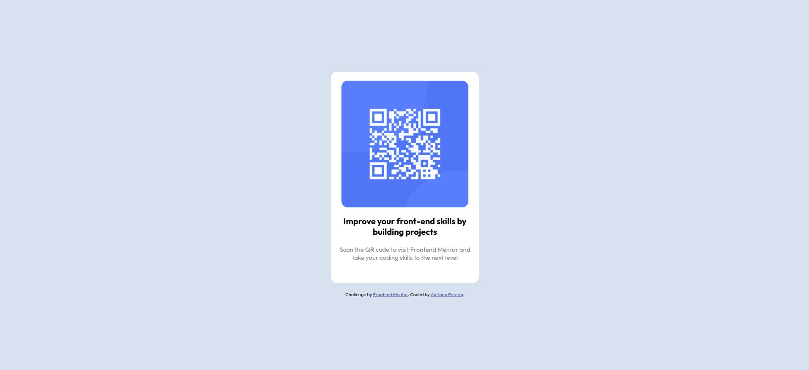

# Frontend Mentor - QR code component solution

This is a solution to the [QR code component challenge on Frontend Mentor](https://www.frontendmentor.io/challenges/qr-code-component-iux_sIO_H). Frontend Mentor challenges help you improve your coding skills by building realistic projects. 

## Table of contents

- [Overview](#overview)
  - [Screenshot](#screenshot)
  - [Links](#links)
- [My process](#my-process)
  - [Built with](#built-with)
  - [What I learned](#what-i-learned)
  - [Continued development](#continued-development)
  - [Useful resources](#useful-resources)
- [Author](#author)
- [Acknowledgments](#acknowledgments)

## Overview

### Screenshot



### Links

- Solution URL: https://github.com/adrianorazzor/qr-code-component
- Live Site URL: https://adrianorazzor.github.io/qr-code-component/

## My process

### Built with

- HTML5
- CSS
- Flexbox

### What I learned

In this project I used what they call "CSS reset", changing the box-sizing model to border box and applying margin 0 to the page's elements.
The main thing that I used is the flexbox, which is something that I just learned and i'm trying to get good at.

```css
.*,
*::before,
*::after
{
    box-sizing: border-box;
}

body,
h1,
h2,
h3,
p {
    margin: 0;
}
}
```

### Continued development

My focus now is to keep practicing the flebox, which is one thing I'm struggling a little bit.

## Author

- Website - [Adriano Pereira](https://github.com/adrianorazzor)
- Frontend Mentor - [@adrianorazzor](https://www.frontendmentor.io/profile/adrianorazzor)

## Acknowledgments

I'm really grateful for all the people whose I'm learning from. Some resources that inspire me:
- https://www.youtube.com/c/InternetMadeCoder
- https://www.youtube.com/kepowob
- https://www.theodinproject.com/
- https://www.frontendmentor.io/
